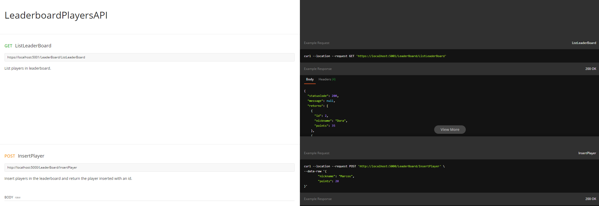

<h1 align="center">Bem Vindo ao LeaderBoardPlayer 👋</h1>

| Postman Documentation |              
| :------------------------: | 
|  |

  
  
  
  
  
  

> Aplicação desenvolvida em C# para cadastro de jogadores em um Leaderboard utilizando **Redis** como banco de dados em memória.

### 🏠 [Pagina Inicial](https://github.com/matheusnalmeida/LeaderBoardPlayerAPI)

## Pre Requisitos

- C#
- AspNet MVC
- Redis

## Usabilidade

> Inicialmente é necessário rodar o redis localmente na porta padrão(**localhost:6379**). Caso queira rodar em outra porta será necessário alterar a variavel RedisConnection no arquivo de configuração **appsettings.json**. Tendo isso configurado somente será executar a api ou pelo visual studio ou rodando o comando **dotnet watch run** dentro da pasta **LeaderBoardPlayersAPI**. Para chamar a requisição, por padrão a api estará rodando com a url **https://localhost:5001/LeaderBoard**.

## Documentação do postman

- Link de documentação do postman para os endpoints da api: https://documenter.getpostman.com/view/12304172/TVzLpgCM

## Rotas

- Existem 5 rotas principais descritas na api do postman sendo elas resumidamente

   1 - ListLeaderBoard: Listagem de todos os jogadores na ordem por pontuação. 
   2 - InsertPlayer: Insere um jogador e retorna o mesmo inserindo com seu respectivo id. 
   3 - GetPlayer:Retorna um dado jogador que possua o id especificado. 
   4 - EditPlayer: Edita um dado jogador que possua o id especificado. 
   5 - DeletePlayer: Deleta um jogador que possua o id especificado. 

## Autor

👤 **Matheus Nunes De Almeida**

* GitHub: [@matheusnalmeida](https://github.com/matheusnalmeida)
* LinkedIn: [@https:\/\/www.linkedin.com\/in\/matheus-nunes-de-almeida-387980194\/](https://www.linkedin.com/in/matheus-nunes-de-almeida-387980194/)

## Demonstre seu suporte

De uma ⭐️ se este projeto te ajudou!

## 📝 Licença

Copyright © 2020 [Matheus Nunes De Almeida](https://github.com/matheusnalmeida). 
Esse projeto possui [MIT](https://github.com/matheusnalmeida/LeaderBoardPlayerAPI/blob/master/LICENSE) license.

***
_This README was generated with ❤️ by [readme-md-generator](https://github.com/kefranabg/readme-md-generator)_
